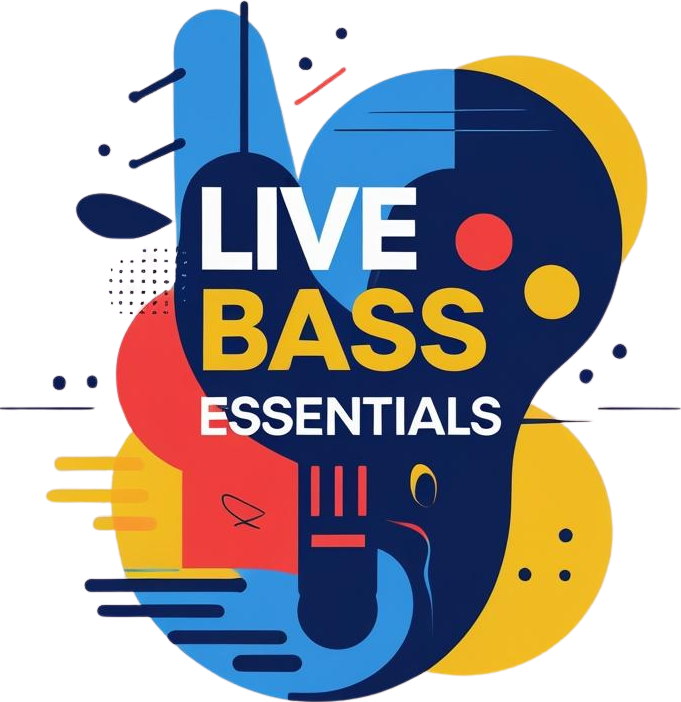

<p align="center">
  
</p>

<h1 align="center">LBE Lab</h1>

<p align="center">
  A progressive web app for bass players — drone engine, metronome, fretboard, and focus timer in one tool.
</p>

<p align="center">
  Built with Vite + React + Tailwind CSS v4 + vite-plugin-pwa
</p>

---

## Drone Engine

Sustained tones for practicing intonation, intervals, and chord voicings. Select a root note by tapping the fretboard or choosing from the note selector.

- **9 synth textures**: Bass Guitar, Organ Pad, Rhodes EP, Pure Sine, Deep Earth, Vintage Warmth, Silk Bow, Singing Bowl, Pure Breath
- **Harmony stacking**: layer intervals (5th, 4th, octave, octave down, major 3rd, minor 3rd, flat 7, major 7) or full chords (major, minor, dim, aug triads and 7th chords)
- **Custom drone mode**: tap individual fretboard notes to build custom voicings with real-time chord analysis
- **Tone shaping**: dark-to-bright knob controlling low-shelf and high-shelf EQ
- **Adjustable tuning**: A4 reference from 415–465 Hz

## Metronome

Full-featured click with two operating modes.

### Standard Mode

- **BPM range**: 20–450, adjustable via drag knob, +/- buttons, or tap tempo
- **Time signatures**: 4/4, 3/4, 5/4, 6/8, 7/8, 9/8, 11/8
- **Subdivisions**: 8th notes, triplets, 16th notes, or off
- **Click patterns**: all beats, downbeat only, or custom per-beat emphasis (tap beat dots to cycle normal → accent → off)
- **4 click sounds**: Normal (clave), Woodblock, Kick, Beep — each with a tone knob
- **1-bar count-in**
- **Gap training**: silent bars for internalization (presets: 1/2/4/8 bar, or custom play/silent cycle)
- **Tempo ramp**: gradual BPM increase from start tempo to a target over a configurable number of bars

### Clave Mode

- **4/4 patterns**: Son clave, Rumba clave, with 3-2 or 2-3 direction
- **6/8 patterns**: 6/8 clave, Bembe, with forward or reverse direction
- **Quarter pulse / big beat pulse**: optional steady pulse underneath the clave, with independent click sound selection
- **Count-in, gap training, and tempo ramp** available in clave mode as well

## Fretboard

Interactive bass fretboard (17 frets) for note selection and visual reference.

- **4, 5, or 6 string configurations** with standard tuning (E-A-D-G, B-E-A-D-G, or B-E-A-D-G-C)
- Tap any note to hear it, set the drone root, and highlight matching notes across the board
- Root note and octave-equivalent highlights
- Fret markers at positions 3, 5, 7, 9, 12, 15

## Mixer

Independent volume sliders for master output, drone, metronome, and pink noise.

## Pink Noise Generator

Ambient noise for focus and ear fatigue reduction.

- Volume and tone controls (dark to bright)
- Root-frequency resonance that follows the drone root note
- Routed through its own bus, bypassing the compressor to avoid ducking

## Focus Timer

Pomodoro-style work/break timer for structured practice sessions.

- **Preset modes**: Micro (15/3), Standard (25/5), Deep (50/10), Extended (90/20), Custom
- **Session preview**: proportional duration bar showing work and break periods before starting
- **Break automation**: sounds turn off at break start; "All On" button preserves your session so you can resume with one tap when the break ends
- **Transition chimes**: harmonized pentatonic chimes for session transitions — work-complete chord, break-end bell sequence, and cycle notification
- **Daily minutes tracker**: persisted to localStorage
- **Break overlay and break-end overlay** with skip/dismiss options
- **Intention field** for setting a practice focus

## Audio Architecture

All audio is synthesized in real time using the Web Audio API — no samples or external audio files.

- **Signal chain**: source buses → master gain → highpass filter → tilt EQ → low-frequency saturator → glue compressor → limiter → output
- **Low-frequency saturation**: crossover split at 250 Hz, asymmetric tanh waveshaper on the low band with wet/dry blend — adds harmonics so bass content is audible on small speakers
- **Per-bus gain nodes**: drone, metronome, fretboard, chime, and noise each have independent gain staging
- **Noise bypass**: pink noise routes around the compressor directly to the limiter to prevent ducking
- **Tone shaping**: independent low-shelf + high-shelf filters on drone and metronome buses

## Interface

- **Three themes**: Dark, Light, Underwater (glass-morphism with backdrop blur)
- **Draggable panel ordering**: reorder modules via drag-and-drop with real-time visual feedback
- **Responsive layout**: adapts to mobile, tablet, and desktop
- **iOS PWA safe area**: notch and home indicator padding when installed as a standalone app
- **Global pause/resume**: spacebar shortcut, pauses all audio with elapsed time display
- **All Off / All On toggle**: saves and restores the full audio state
- **Wake lock**: prevents screen sleep during practice

## Installation

```
npm install
npm run dev
```

To build for production:

```
npm run build
```

The `dist/` folder can be deployed to any static hosting service (Cloudflare Pages, Vercel, Netlify, GitHub Pages). HTTPS is required for PWA service worker functionality.

---

## License

© Chris Watkins. All rights reserved.

## AI Disclosure

The code for this project was generated with the assistance of Claude, an AI assistant made by Anthropic.
